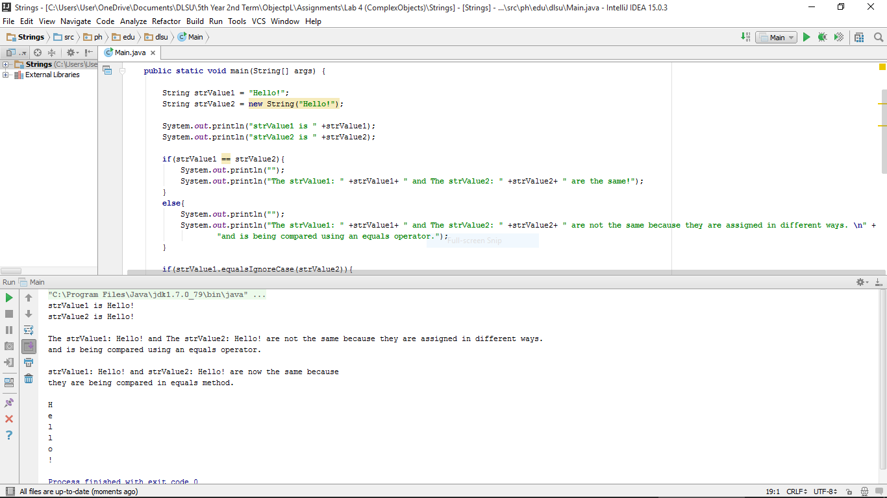

#Strings

Assigning and comparing strngs in different ways.

#ScreenShot

#Code

~~~
package ph.edu.dlsu;

public class Main {

    public static void main(String[] args) {

        String strValue1 = "Hello!";
        String strValue2 = new String("Hello!");

        System.out.println("strValue1 is " +strValue1);
        System.out.println("strValue2 is " +strValue2);

        if(strValue1 == strValue2){
            System.out.println("");
            System.out.println("The strValue1: " +strValue1+ " and The strValue2: " +strValue2+ " are the same!");
        }
        else{
            System.out.println("");
            System.out.println("The strValue1: " +strValue1+ " and The strValue2: " +strValue2+ " are not the same because they are assigned in different ways. \n" +
                    "and is being compared using an equals operator.");
        }

        if(strValue1.equalsIgnoreCase(strValue2)){
            System.out.println("");
            System.out.println("strValue1: " +strValue1+ " and strValue2: " +strValue2+ " are now the same because \n" +
                    "they are being compared in equals method.");
        }
        else{
            System.out.println("They don't match!");
        }

        char[] chars = strValue1.toCharArray();
        System.out.println("");
        for (char c :chars) {
            System.out.println(c);
        }

    }
}

~~~
